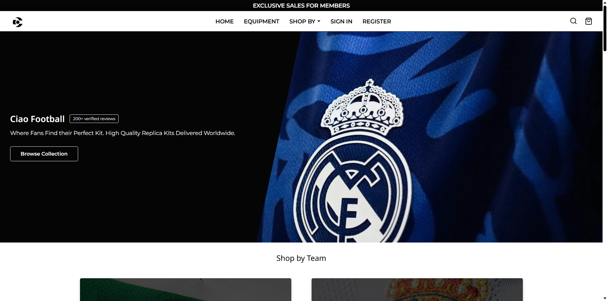

# Ciao Football

## Project Overview
Current work in progress e-commerce store for a hypothetical London based replica, retro & specialist football shirt retailer. This is my final website to be built in college, so I am going all out and really testing myself.
Code comments will be plentiful as I will be marked on the source code's readability, coding standards and maintainability.

## Development Notes
In development as you read this. I am developing it at Home and in College. I am actively learning prepared SQL statements, so if it seems a bit weird or inconsistent across pages, it is because I'm not 100% in it yet.

I am also tackling this build by using component architecture via PHP. Finishing a 'component' and including the file with PHP. While this isn't the same as a JavaScript framework in any way, this is to get my mind into the habit of developing components. 

## Future Plans
It is still a work in progress, nowhere near finished. 

## Test Credentials
There are no test credentials yet, as the project hasn't been finished. You could register an account and log in (auto-login is a feature on registration); however, if you do so, please make your username unique so I don't accidentally delete it in my testing. Also, please don't use any sensitive or personal data; while I am trying to keep this project as secure as possible, I can't guarantee everything is 100% secure as I am still learning. Make sure to use fake data. Check back at a later date for demo accounts once the project has been completed.  

## Key Technologies
- PHP & MySQL database
- Component based architecture
- CSS grid & Flex layout
- CSS Variables
- Custom feedback system similar to toast notifications

## Testing Instructions
Check back later once the project is finished and is live.

## Live Demo

You can view the unfinished website via this link: [Ciao Football](http://webdev.edinburghcollege.ac.uk/HNCWEBMR11/GradedUnitCode/frontend/) or view the code in the repo. Bonus point if you can figure out my favourite football team 😉

